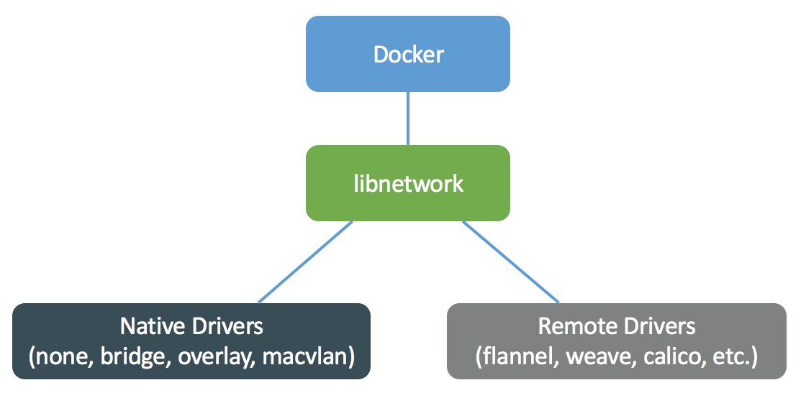

# 1 docker 架构

从Docker 1.11之后，Docker Daemon被分成了多个模块以适应OCI标准。其中，containerd独立负责容器运行时和生命周期（如创建、启动、停止、中止、信号处理、删除等），其他一些如镜像构建、卷管理、日志等由Docker Daemon的其他模块处理。


## 1.2 Docker Engine

从 Docker 1.11 开始，docker 容器运行已经不是简单地通过 Docker Daemon 来启动, 而是集成了**Containerd**, **RunC** 等多个组件。Docker 服务启动之后, 可以看到系统上启动了 dockerd, docker-containerd等进程.

docker daemon 作为Docker容器管理的守护进程，从最初集成在docker命令中（1.11版本前），到后来的独立成单独二进制程序（1.11版本开始），其功能正在逐渐拆分细化，被分配到各个单独的模块中去。
  docker 1.8 之前, 启动会命令:
  `$ docker -d`
  docker 1.8 之后, 启动命令变成了：
  `$ docker daemon`
  docker 1.11 开始, 启动命令变成了 :
  `$ dockerd`

dockerd本身属于对容器相关操作的api的最上层封装，直接面向操作用户，实际通过gRPC调用containerd的api接口，containerd是dockerd和runC之间的一个中间交流组件。


## 1.3. Containerd

containerd 是容器技术标准化之后的产物，为了能够兼容 OCI 标准，docker公司将容器**运行时**及其**管理功能**从 Docker Daemon 剥离，作为独立的开源项目发展和运营。理论上，即使不运行 dockerd 也能直接通过 containerd 来管理容器.(containerd 本身也只是一个守护进程, 容器的实际运行时由 runC 控制.)


containerd主要职责是

- **镜像管理**     - 镜像, 元信息等
- **容器执行**  - 调用最终运行时组件执行。

containerd并不是直接面向最终用户的，而是主要用于集成到更上层的系统里，比如Swarm, Kubernetes, Mesos等容器编排系统，以Daemon的形式运行在Linux或Windows系统上，通过unix domain docket暴露低层的gRPC API，上层系统可以通过这些API管理机器上的容器。

每个containerd只负责一台机器，实现Pull镜像，启动、停止容器，网络，存储等功能。containerd底层通过 **docker-containerd-shim** 结合 runC或者任何与 OCI 兼容的运行时管理容器的生命周期。


### 1.3.1 containerd详细架构

containerd详细架构如下：


中间一层里包含了三个子系统，支持以下功能：

- Distribution: 和Docker Registry打交道，拉取镜像
- Bundle: 管理本地磁盘上面镜像的子系统。
- Runtime：创建容器、管理容器的子系统。


containterd上接docker daemon，下连shim。将docker daemon传过来的GRPC消息转化成实际要操作runc要执行的命令。containerd 最重要的就是Supervisot中的两个go chan:Task 和startTask。 

### 1.3.2 [containerd-cri](https://github.com/containerd/cri)

通过containerd的cri插件，Kubernetes使用containerd作为容器运行时：


cri在containerd1.1版本中，作为一个本地的插件被内置到containerd中并默认启用。

## 1.4 docker-containterd-shim

docker-containterd-shim是一个真实运行的容器的垫片载体，每启动一个容器都会起一个新的docker-containterd-shim的一个进程，docker-containterd-shim通过指定的三个参数：容器id，boundle目录（containerd的对应某个容器生成的目录，一般位于：/var/run/docker/libcontainerd/containerID）， 运行时二进制（默认为runc）来调用runc的api创建一个容器


# 6. Container网络

目前，关于Linux容器网络有两种的可能的标准：容器网络模型（CNM）和容器网络接口（CNI）。

## 6.1 CNM

### 6.1.1 CNM介绍

CNM是Docker被提出的容器网络规范，现在已经被Cisco Contiv, Kuryr, Open Virtual Networking (OVN), Project Calico, VMware 和 Weave 这些公司和项目所采纳。

**Libnetwork**是CNM的原生实现。它为**Docker daemon**和 **网络驱动** 提供接口。每个驱动程序负责管理它所拥有的网络，并为该网络提供各种服务，例如IPAM等。多个由不同驱动支撑的网络可以同时并存。


网络驱动可以划分为**Native Drivers**(原生驱动，libnetwork内置的或Docker支持的)和**Remote Drivers**(远程驱动，用于支持第三方插件)。也可以按照适用范围被划分为本地（单主机）的和全局的 (多主机）。

libnetwork CNM 定义了 docker 容器的网络模型，按照该模型开发出的 driver 就能与 docker daemon 协同工作，实现容器网络。docker 原生的 driver 包括 none、bridge、overlay 和 macvlan，第三方 driver 包括 flannel、weave、calico 等:


### 6.1.2 CNM组件

CNM模型中对容器网络进行抽象，由以下三类组件组成：


- Sandbox

  容器内部的网络协议栈，包含容器的interface，route，DNS设置。Sandbox 可以包含来自不同 Network 的 Endpoint。

- Endpoint

  Endpoint 的作用是将 Sandbox 接入 Network。Endpoint 的典型实现是 veth pair。一个容器可以有多个endpoints，一个 Endpoint 只能属于一个网络，也只能属于一个 Sandbox。

- Network

  Network 包含一组 Endpoint，同一 Network 的 Endpoint 可以直接通信。Network 的实现可以是 Linux Bridge、VLAN 等。

最后，CNM还支持标签(labels)。Lable是以key-value对定义的元数据。用户可以通过定义label这样的元数据来自定义libnetwork和驱动的行为。

### 6.1.3 Remote Drivers

docker把网络部分提取成了libnetwork，并实现了host、overlay、null和remote等几个driver，其中remote就是为其他项目管理docker的网络留的接口。remote采用rpc的方式将参数通过网络发给外部管理程序，外部程序处理好了后通过json返回结果给remote。

 libnetwork的remote driver定义了基本的创建网络/port的接口，只要对应的REST Server实现了这些接口，就可以提供整套docker的网络。这些接口有：Create network、Delete network、Create endpoint、Delete endpoint、Join（绑定）、Leave（去绑定）。

remote driver的接口定义在 https://github.com/docker/libnetwork/blob/master/docs/remote.md

用remote driver分配了设备一般是不带IP的，libnetwork使用ipam driver来管理ip。这些接口有： 

- GetDefaultAddressSpaces    获取保留IP


- RequestPool         获取IP地址池
- ReleasePool          释放IP地址池
- RequestAddress   获取IP地址
- ReleaseAddress    释放IP地址

ipam driver的接口定义在 https://github.com/docker/libnetwork/blob/master/docs/ipam.md
libnetwork的插件发现机制在 https://github.com/docker/docker/blob/master/docs/extend/plugin_api.md#plugin-discovery


## 6.2 CNI

### 6.2.1 CNI介绍

CNI是由CoreOS提出的一个容器网络规范。已采纳改规范的包括Apache Mesos, Cloud Foundry, Kubernetes, OpenShift 和 rkt。另外 Contiv Networking, Project Calico 和 Weave这些项目也为CNI提供插件。


CNI 的规范比较小巧，本身并不完全针对docker的容器，而是提供一种普适的容器网络解决方案。它规定了一个**容器runtime**和**网络插件**之间的简单的契约。这个契约通过JSON的语法定义了CNI Plugin所需要提供的输入和输出。

CNI的实现依赖于两种plugin：CNI Plugin负责将容器connect/disconnect到host中的vbridge/vswitch，IPAM Plugin负责配置容器namespace中的网络参数。

 每个网络有自己对应的插件和唯一的名称。CNI Plugin需要提供两个命令：一个用来将网络接口加入到指定网络，另一个用来将其移除。这两个接口分别在容器被创建和销毁的时候被调用。

### 6.2.2 CNI接口

CNI只有两类接口: AddNetwork/DelNetwork。

```go
type CNI interface {
        AddNetworkList(net *NetworkConfigList, rt *RuntimeConf) (types.Result, error)
        DelNetworkList(net *NetworkConfigList, rt *RuntimeConf) error

        AddNetwork(net *NetworkConfig, rt *RuntimeConf) (types.Result, error)
        DelNetwork(net *NetworkConfig, rt *RuntimeConf) error
}
```

包含以下两个输入参数：

```go
type NetworkConfig struct {
        Network *types.NetConf
        Bytes   []byte
}

type RuntimeConf struct {
        ContainerID string         //容器ID
        NetNS       string         //容器NS
        IfName      string         //容器内网卡名称
        Args        [][2]string
        CapabilityArgs map[string]interface{}
}

type NetConf struct {
        CNIVersion   string          `json:"cniVersion,omitempty"`
        Name         string          `json:"name,omitempty"`
        Type         string          `json:"type,omitempty"`
        Capabilities map[string]bool `json:"capabilities,omitempty"`
        IPAM         IPAM            `json:"ipam,omitempty"`
        DNS          DNS             `json:"dns"`
}
```


### 6.2.2 CNI Flow

容器runtime首先需要分配一个网络命名空间以及一个容器ID。然后连同一些CNI配置参数传给网络驱动。接着网络驱动会将该容器连接到网络并将分配的IP地址以JSON的格式返回给容器runtime。

Mesos 是最新的加入CNI支持的项目。Cloud Foundry的支持也正在开发中。当前的Mesos网络使用宿主机模式，也就是说容器共享了宿主机的IP地址。Mesos正在尝试为每个容器提供一个自己的IP地址。这样做的目的是使得IT人员可以自行选择适合自己的组网方式。

目前，CNI的功能涵盖了IPAM, L2 和 L3。端口映射(L4)则由容器runtime自己负责。CNI也没有规定端口映射的规则。这样比较简化的设计对于Mesos来讲有些问题。端口映射是其中之一。另外一个问题是：当CNI的配置被改变时，容器的行为在规范中是没有定义的。为此，Mesos在CNI agent重启的时候，会使用该容器与CNI关联是的配置。

<引用：http://dockone.io/article/1974>

##  6.3 CNM/CNI比较

从模型中来看，CNI中的container应与CNM的sandbox概念一致，CNI中的network与CNM中的network一致。在CNI中，CNM中的endpoint被隐含在了ADD/DELETE的操作中。CNI接口更加简洁，把更多的工作托管给了容器的管理者和网络的管理者。从这个角度来说，CNI的ADD/DELETE接口其实只是实现了docker network connect和docker network disconnect两个命令。

kubernetes/contrib项目提供了一种从CNI向CNM转化的过程。其中原理很简单，就是直接通过shell脚本执行了docker network connect和docker network disconnect命令，来实现从CNI到CNM的转化。

# 7. Compose

随着不断地发展与完善，Docker 的 API 接口变得越来越多。尤其在容器参数的配置方面。功能的完善势必造成参数列表的增长。若在 Docker 的范畴内管理容器,则唯一的途径是使用 Docker Client 。而 Docker Client 最原生的使用方式是:利用 docker 二进制文件发送命令行命令。最原始的情况下,通过 Docker Client 发送容器管理请求,尤其是 docker run 命令,一旦参数数量骤增,通过命令行终端来配置容器较为耗时,同时容错性较差,且修复错误命令的时间成本很高。

Compose 则将所有容器参数通过精简的配置文件来存储，用户最终通过简短有效的 docker-compose 命令管理该配置文件，完成 Docker 容器的部署。


# 8. attechment
container架构

docker client -> REST API -> Docker Server --> Docker Engine --> Containerd / runc --> libcontainers  --> namespace/cgroup/rootfs


